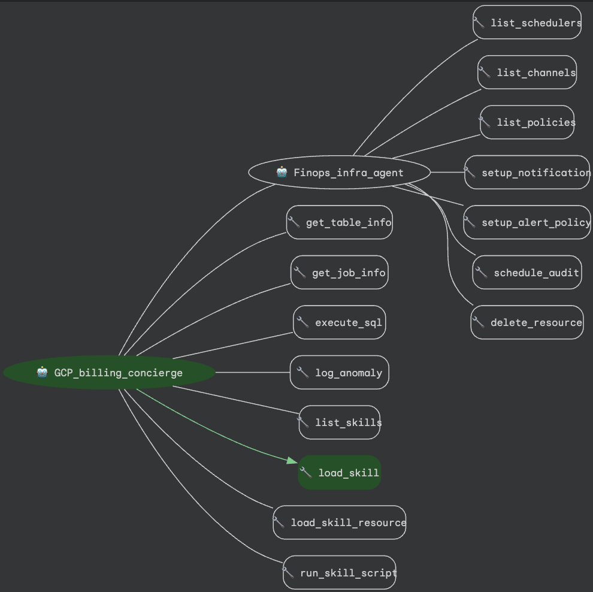

# 💰 Billing Concierge Agent
An intelligent automation agent that simplifies Google Cloud cost management. Starting with answering billing questions, this agent also acts as a FinOps concierge—capable of auditing environments, detecting anomalies, and provisioning monitoring infrastructure using natural language. Built with Google ADK, Gemini, and deployed via `google-agents-cli` on Vertex AI.

🛠️ Integrated Cloud Ecosystem:
The agent seamlessly orchestrates the following Google Cloud services:
- **BigQuery**: Analysis of Standard/Detailed Billing Exports.
- **Cloud Scheduler**: Automation of recurring cost audits and reporting.
- **Cloud Monitoring**: Dynamic provisioning of Alert Policies and Notification Channels.
- **Cloud Logging**: Recording of detected billing anomalies.
- **Secret Manager**: Secure management of Agent metadata and IDs.

---

## 📋 Prerequisites
Before running the setup, ensure you have:

* **Python 3.11+** and **uv package manager** [(uv Installation guide)](https://docs.astral.sh/uv/getting-started/installation/)
* **gcloud CLI** installed and authenticated. [(Google SDK Installation guide)](https://docs.cloud.google.com/sdk/docs/install-sdk)
* **Application Default Credentials** set with `gcloud auth application-default login`.
* **Google Agents CLI & ADK** installed via `uvx google-agents-cli setup` [(ADK Docs)](https://adk.dev/get-started/installation/)
* Optional: **Gemini Enterprise application** with Gemini Enterprise or Business licenses. [(Gemini Enterprise Quickstart Guide)](https://docs.cloud.google.com/gemini/enterprise/docs/quickstart-gemini-enterprise).

### 📊 Billing Export Setup
**Recommended:** Enabling a BigQuery billing export is a highly common and recommended FinOps best practice. The GCP Billing Concierge relies on this billing export for live querying.
If you do not have an existing export, the setup script (`make setup_billing_data` or `make install`) includes an option to generate a sample dataset for testing purposes.

- [Official Documentation: Set up Cloud Billing data export to BigQuery](https://cloud.google.com/billing/docs/how-to/export-data-bigquery)
- **Key Requirement:** You must have the `Billing Account Administrator` role on the Cloud Billing account to enable this export.
- **Latency Note:** Once enabled, it can take 24 to 48 hours for the first data points to appear in BigQuery.

---

## 📂 Project Structure

```text
.
├── GCP_billing_concierge /            # Root directory for Agent Logic
│   ├── agent.py                       # Main Orchestrator Agent (Billing Concierge)
│   ├── prompt.py                      # Orchestrator system instructions
│   ├── .env.example                   # Sample .env file for setting env vars
│   ├── tools/
│   │   └── tools.py                   # Custom tools for Logging
│   └── sub_agents/
│       └── finops_infra_agent/        # Specialized agent for Platform Ops
│           ├── agent.py               # Sub-agent: Handles infrastructure tasks
│           ├── prompt.py              # Sub-agent: Instructions for CRON and Monitoring
│           └── tools/
│                └── tools.py          # Custom tools (Scheduler, Alerts, Notifications)
├── deployment_scripts/                
│   ├── setup_billing_data.py          # Configures BQ dataset (Real or Mock)
│   └── create_sa.py                   # Provisions the Agent Service Account & IAM
├── mock_data/  
│   ├── billing_export_test_table.json # Sample billing dataset
│   └── billing_schema.json            # Sample billing dataset schema
├── gcp_billing_concierge_agent_evals/ # Evaluation benchmark suite
│   ├── golden_dataset.json            # Ground truth eval questions & expected queries
│   └── run_eval.py                    # Evaluation runner script
├── agents-cli-manifest.yaml           # Manifest for google-agents-cli lifecycle
├── pyproject.toml                     # Project dependencies & configuration
├── Makefile                           # Target automation for install, run, and deploy
└── README.md
```

### Agent Architecture


---

## 🔑 Permissions & Roles Used

### For the Admin (You)
* `roles/resourcemanager.projectIamAdmin`: To manage Service Account roles.
* `roles/iam.serviceAccountAdmin`: To create the agent identity.
* `roles/bigquery.admin`: To configure datasets and verify schemas.
* `roles/aiplatform.admin`: To deploy agent to Vertex AI Reasoning Engine / Agent Runtime.
* `roles/secretmanager.admin`: To create and manage the Agent ID secret.
* `roles/bigquery.dataViewer`: Minimum access needed to the existing **Billing Export table**.

### For the Agent (Service Account)
The `make install` (or `make create_sa`) script creates `gcp-billing-concierge-sa` and grants:

**Agent Project (Local Execution & Infra Management):**
* BigQuery: `roles/bigquery.jobUser` (To run analysis jobs).
* AI & Vertex: `roles/aiplatform.user` and `roles/geminidataanalytics.dataAgentStatelessUser`.
* Infrastructure Ops: 
  * `roles/cloudscheduler.admin`: To manage recurring audit schedules.
  * `roles/monitoring.alertPolicyEditor`: To create and edit billing alerts.
  * `roles/monitoring.notificationChannelEditor`: To manage email notification targets.
* Logging: `roles/logging.logWriter` and `roles/logging.configWriter` (For anomaly logging).
* Secrets: `roles/secretmanager.secretAccessor` (To retrieve its own Agent ID).
* Utility: `roles/serviceusage.serviceUsageConsumer` and `roles/telemetry.writer`.
* Identity: `roles/iam.serviceAccountUser` (Self-assigned so Cloud Scheduler can trigger the agent).

**Billing Project (Data Access):**
* `roles/bigquery.dataViewer`: Granted strictly at the table level for the Billing Export data.

---

## 🚀 Quickstart & Usage

There are two primary ways to deploy and use the agent:

1. **Fast Track**: Scaffold and deploy using `google-agents-cli`.
2. **Custom / Clone**: Clone this repository for development, customization, and deployment.

---

### Method 1: Using `google-agents-cli` (Fast Track)

#### Step 1: Install `google-agents-cli` & Authenticate
```bash
uvx google-agents-cli setup
gcloud auth application-default login
```

#### Step 2: Create Project from Template
```bash
export AGENT_NAME=billing-concierge-${RANDOM}
uvx google-agents-cli create ${AGENT_NAME} -d agent_runtime -a pemujo/GCP-Billing-Concierge
cd ${AGENT_NAME}
make install
```

#### Step 3: Run Locally or Deploy
```bash
# Test interactively in terminal:
make run

# Deploy to Vertex AI Agent Runtime:
make deploy
```

---

### Method 2: GitHub Clone and Deploy (Development Flow)

#### Step 1: Clone and Configure Environment
```bash
git clone https://github.com/pemujo/GCP-Billing-Concierge.git
cd GCP-Billing-Concierge

# Install dependencies with uv
uv sync

# Create .env from template
cp GCP_billing_concierge/.env.example GCP_billing_concierge/.env
```

Edit `GCP_billing_concierge/.env`:
```bash
# Vertex AI Agent Engine Configuration
GOOGLE_CLOUD_PROJECT="your-project-id"
GOOGLE_CLOUD_LOCATION="us-central1"

# Billing Data Source (BigQuery)
BILLING_EXPORT_PROJECT_ID="your-billing-project"
BILLING_EXPORT_DATASET="your_dataset"
BILLING_EXPORT_TABLE="your_table"
```

#### Step 2: One-Step Provisioning (`make install`)
Run the automated installation target:
```bash
make install
```
This target:
1. Validates `GOOGLE_CLOUD_PROJECT` and target region.
2. Enables all necessary Google Cloud APIs (`aiplatform`, `bigquery`, `logging`, `cloudscheduler`, etc.).
3. Configures billing data (points to live export or provisions mock dataset).
4. Creates `gcp-billing-concierge-sa` and applies all IAM role bindings.

#### Step 3: Test Locally
Chat with the agent in your terminal:
```bash
make run
# or directly:
uvx google-agents-cli run
```

#### Step 4: Deploy to Vertex AI Agent Runtime
Deploy the agent to managed cloud infrastructure:
```bash
make deploy
# or directly:
uvx google-agents-cli deploy
```

Upon successful deployment:
* `agents-cli deploy` packages the agent and deploys to Vertex AI.
* `make store_agent_id` extracts the deployed Agent ID from `deployment_metadata.json` and syncs it to Secret Manager (`billing-concierge-agent-id`).
* Scheduled audits provisioned by `finops_infra_agent` automatically invoke the live Agent Runtime.

#### Step 5: Run Evaluation Benchmarks
Benchmark agent accuracy against the golden dataset:
```bash
make eval
# or directly:
uvx google-agents-cli eval
```

#### Step 6: Register with Gemini Enterprise (Optional)
Register your deployed agent so users can discover and interact with it in Gemini Enterprise using `google-agents-cli`:
```bash
uvx google-agents-cli publish gemini-enterprise --interactive
```

---

## 📝 Disclaimer
This agent sample is provided for illustrative purposes only and is not intended for production use. It serves as a foundational starting point for teams to develop their own agents.

Users are responsible for the development, testing, and security hardening of any agents derived from this sample.
