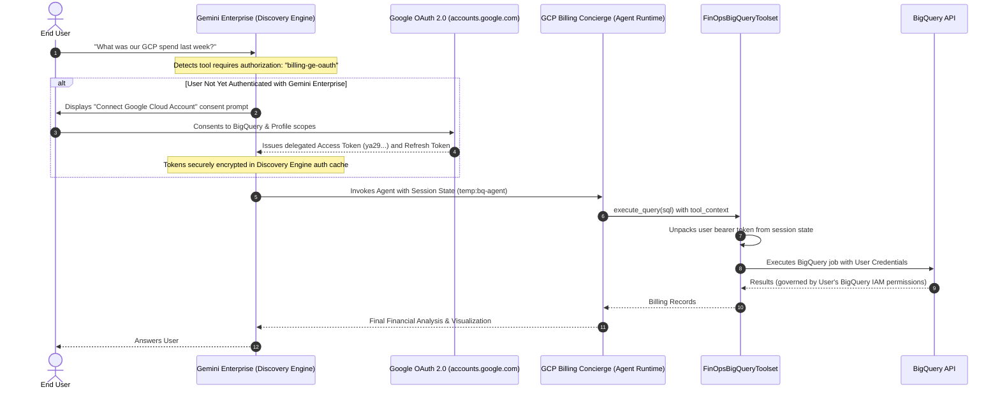

# 💰 Billing Concierge Agent
An intelligent automation agent that simplifies Google Cloud cost management. Starting with answering billing questions, this agent also acts as a FinOps concierge—capable of auditing environments, detecting anomalies, and provisioning monitoring infrastructure using natural language. Built with Google ADK, Gemini, and deployed via `google-agents-cli` on Agent Runtime (Gemini Enterprise Agent Platform).

🛠️ Integrated Cloud Ecosystem:
The agent seamlessly orchestrates the following Google Cloud services:
- **BigQuery**: Analysis of Standard/Detailed Billing Exports.
- **Cloud Scheduler**: Automation of recurring cost audits and reporting.
- **Cloud Monitoring**: Dynamic provisioning of Alert Policies and Notification Channels.
- **Cloud Logging**: Recording of detected billing anomalies.
- **Secret Manager**: Secure management of Agent metadata and IDs.

---

## 📋 Prerequisites
Before running the setup, ensure you have:

* **Python 3.11+** and **uv package manager** [(uv Installation guide)](https://docs.astral.sh/uv/getting-started/installation/)
* **gcloud CLI** installed and authenticated. [(Google SDK Installation guide)](https://docs.cloud.google.com/sdk/docs/install-sdk)
* **Application Default Credentials** set with `gcloud auth application-default login`.
* **Google Agents CLI & ADK** installed via `uvx google-agents-cli setup` [(ADK Docs)](https://adk.dev/get-started/installation/)
* **Gemini Enterprise application** (Optional, for conversational enterprise search/chat integration) with Gemini Enterprise or Business licenses. [(Gemini Enterprise Quickstart Guide)](https://docs.cloud.google.com/gemini/enterprise/docs/quickstart-gemini-enterprise).
* **Google OAuth 2.0 Client Credentials** (Required for End-User OAuth identity delegation):
  * **OAuth Consent Screen**: In Google Cloud Console (**APIs & Services > OAuth consent screen**), configure an **Internal** app (recommended for enterprise Google Workspace accounts) or **External** app, specifying your support email and developer contact.
  * **Scopes**: Ensure the following scopes are configured on the consent screen:
    * `https://www.googleapis.com/auth/bigquery` (View and manage data in Google BigQuery)
    * `https://www.googleapis.com/auth/userinfo.email`
    * `https://www.googleapis.com/auth/userinfo.profile`
    * `openid`
  * **OAuth Client ID**: Under **APIs & Services > Credentials**, click **Create Credentials > OAuth client ID**:
    * **Application Type**: **Web application**
    * **Name**: `Gemini Enterprise Billing Concierge Web Client`
    * **Authorized JavaScript origins**:
      * `http://localhost:8080`, `http://127.0.0.1:8080`
      * `http://localhost:8000`, `http://127.0.0.1:8000`
    * **Authorized redirect URIs** (Critical):
      * `https://vertexaisearch.cloud.google.com/static/oauth/oauth.html` (*Mandatory for Gemini Enterprise Discovery Engine callback*)
      * `http://127.0.0.1:8080/dev-ui/` and `http://localhost:8080/dev-ui/` (*For local ADK Web playground testing*)
      * `http://127.0.0.1:8000/dev-ui/` and `http://localhost:8000/dev-ui/`
  * **Save Credentials**: Copy your **Client ID** and **Client Secret** into your `.env` file (`OAUTH_CLIENT_ID` and `OAUTH_CLIENT_SECRET`).

### 📊 Billing Export Setup
**Recommended:** Enabling a BigQuery billing export is a highly common and recommended FinOps best practice. The GCP Billing Concierge relies on this billing export for live querying.
If you do not have an existing export, the setup script (`make install`) includes an option to generate a sample dataset for testing purposes.

- [Official Documentation: Set up Cloud Billing data export to BigQuery](https://cloud.google.com/billing/docs/how-to/export-data-bigquery)
- **Key Requirement:** You must have the `Billing Account Administrator` role on the Cloud Billing account to enable this export.
- **Latency Note:** Once enabled, it can take 24 to 48 hours for the first data points to appear in BigQuery.

---

## 📂 Project Structure

```text
.
├── GCP_billing_concierge /            # Root directory for Agent Logic
│   ├── agent.py                       # Main Orchestrator Agent (Billing Concierge)
│   ├── prompt.py                      # Orchestrator system instructions
│   ├── .env.example                   # Environment variable template
│   ├── skills/                        # ADK Agent Skills (analysis, alerting, scheduling)
│   ├── tools/
│   │   ├── finops_bigquery_toolset.py # BigQuery FinOps Toolset (location recovery & budget limits)
│   │   └── tools.py                   # Anomaly and audit logging tools
│   └── sub_agents/
│       └── finops_infra_agent/        # Specialized agent for Platform Ops
│           ├── agent.py               # Sub-agent: Handles infrastructure tasks
│           ├── prompt.py              # Sub-agent: Instructions for CRON and Monitoring
│           └── tools/tools.py         # Custom tools (Scheduler, Alerts, Notifications)
├── deployment_scripts/                
│   ├── setup_billing_data.py          # Configures BQ dataset (Real or Mock)
│   └── create_sa.py                   # Provisions Agent Service Account & IAM roles
├── mock_data/  
│   ├── billing_export_test_table.json # Sample billing dataset
│   └── billing_schema.json            # Sample billing dataset schema
├── new_agent_evals/                   # Modern ADK evaluation benchmark suite
│   ├── billing_eval_dataset_fully_modern.evalset.json
│   └── eval_config.json
├── agents-cli-manifest.yaml           # Manifest for google-agents-cli lifecycle
├── pyproject.toml                     # Project dependencies & configuration
├── Makefile                           # Streamlined automation (install, playground, deploy, eval)
└── README.md
```

### Agent Architecture


---

## 🔑 Permissions & Roles Used

### For the Admin (You)
* `roles/resourcemanager.projectIamAdmin`: To manage Service Account roles.
* `roles/iam.serviceAccountAdmin`: To create the agent identity.
* `roles/bigquery.admin`: To configure datasets and verify schemas.
* `roles/aiplatform.admin`: To deploy agent to Agent Runtime.
* `roles/secretmanager.admin`: To create and manage the Agent ID secret.
* `roles/bigquery.dataViewer`: Minimum access needed to the existing **Billing Export table**.

### For the Agent (Service Account)
The `make install` script creates `gcp-billing-concierge-sa` and grants:

**Agent Project (Local Execution & Infra Management):**
* BigQuery: `roles/bigquery.jobUser` (To run analysis jobs).
* AI & Platform: `roles/aiplatform.user` and `roles/geminidataanalytics.dataAgentStatelessUser`.
* Infrastructure Ops: 
  * `roles/cloudscheduler.admin`: To manage recurring audit schedules.
  * `roles/monitoring.alertPolicyEditor`: To create and edit billing alerts.
  * `roles/monitoring.notificationChannelEditor`: To manage email notification targets.
* Logging: `roles/logging.logWriter` and `roles/logging.configWriter` (For anomaly logging).
* Secrets: `roles/secretmanager.secretAccessor` (To retrieve its own Agent ID).
* Utility: `roles/serviceusage.serviceUsageConsumer` and `roles/telemetry.writer`.
* Identity: `roles/iam.serviceAccountUser` (Self-assigned so Cloud Scheduler can trigger the agent).

**Billing Project (Data Access):**
* `roles/bigquery.dataViewer`: Granted strictly at the table level for the Billing Export data.

---

## 🔐 End-User OAuth 2.0 Security Architecture

To enforce strict FinOps governance and zero-trust access control, the GCP Billing Concierge implements **Dual-Mode End-User OAuth 2.0 Authentication**. Rather than querying billing data with a broad, shared service account, BigQuery queries are executed directly with the **personal Google Cloud IAM credentials of the chatting user**.

### 🛡️ Why End-User OAuth?
1. **Least Privilege Enforcement**: If a user lacks `roles/bigquery.jobUser` on the billing project or `roles/bigquery.dataViewer` on the billing export dataset/table, BigQuery returns HTTP 403 Forbidden. The agent's ambient service account does not grant unauthorized data access.
2. **True Audit Compliance**: All queries appear in Google Cloud Audit Logs with the user's authentic corporate identity (`user@example.com`), satisfying enterprise compliance and accountability standards.
3. **Fail-Closed Protection**: With `REQUIRE_USER_OAUTH=true`, the agent immediately blocks execution if no authenticated user token is present, preventing silent fallback to service account privileges.

### 👤 End-User IAM Permissions Matrix
To successfully query billing data through the agent, the **chatting end user** must have the following IAM roles in Google Cloud:

| Role | Target Resource | Purpose |
| :--- | :--- | :--- |
| `roles/bigquery.jobUser` | Project (`GOOGLE_CLOUD_PROJECT` or `BILLING_EXPORT_PROJECT_ID`) | Allows the user to run BigQuery jobs (queries, dry-runs) in the project. |
| `roles/bigquery.dataViewer` | Dataset/Table (`BILLING_EXPORT_DATASET` / `BILLING_EXPORT_TABLE`) | Grants read access to the Cloud Billing export records. |

> [!IMPORTANT]
> **Zero Trust in Action:** If an employee without these roles tries to chat with the agent in Gemini Enterprise, BigQuery denies the query (`HTTP 403 Access Denied: User does not have bigquery.jobs.create permission` or `Permission Denied on table`). The AI agent cannot be used as an unintended privilege-escalation backdoor.

### 🔄 Dual-Mode Execution Architecture



### ⚙️ How Discovery Engine Authorization Works Under the Hood

The end-user authentication flow bridges Gemini Enterprise and Vertex AI Reasoning Engine:

1. **Discovery Engine Authorization Resource**:
   - Registered under `projects/{PROJECT_NUMBER}/locations/{LOCATION}/authorizations/{AUTH_ID}` (e.g. `billing-ge-oauth`).
   - Stores the server-side OAuth 2.0 Web Client credentials (`clientId`, `clientSecret`, redirect URI, and scopes).
   - Requires numeric **Project Number** (e.g., `813632901865`), which `configure-gemini-oauth` automatically fetches.

2. **Agent Specification Binding (`toolAuthorizations`)**:
   - Once the agent is published to Gemini Enterprise, its Discovery Engine resource is at:  
     `projects/{PROJECT_ID}/locations/{LOCATION}/collections/default_collection/engines/{APP_ID}/assistants/default_assistant/agents/{AGENT_ID}`
   - `make configure-gemini-oauth` sends a PATCH request updating `authorizationConfig.toolAuthorizations` to link the authorization resource.
   - This tells Gemini Enterprise to enforce user consent before invoking the agent's BigQuery tools.

3. **Consent & Token Delegation**:
   - When the user asks a question, Gemini Enterprise prompts the user to **"Connect Google Cloud Account"**.
   - After user consent, Google OAuth redirects back to `https://vertexaisearch.cloud.google.com/static/oauth/oauth.html`.
   - Gemini Enterprise exchanges the authorization code for access and refresh tokens, caching them securely.
   - On each agent turn, Gemini Enterprise injects the delegated bearer token (`ya29...`) into the ADK session state under `temp:bq-agent` (or `temp:{AUTH_ID}`).

4. **Agent Runtime Execution**:
   - `FinOpsBigQueryToolset` inspects `tool_context.session.state` across recognized keys (`temp:bq-agent`, `temp:billing-ge-oauth`, `user_oauth_token`).
   - The token is unpacked into `google.oauth2.credentials.Credentials(token=access_token)`.
   - All BigQuery API operations (query dry-runs, executions, table metadata inspections) run directly under the end user's identity.

5. **Local Mode (ADK Web Playground)**:
   - When developing locally via `make playground`, ADK uses `GoogleCredentialsManager` with your `OAUTH_CLIENT_ID` and `OAUTH_CLIENT_SECRET`.
   - An interactive browser popup prompts for Google login and consent, storing the resulting token in local session state.

### ⚙️ OAuth Configuration Reference

| Environment Variable | Description | Default |
| :--- | :--- | :--- |
| `ENABLE_USER_OAUTH` | Enables resolution of end-user OAuth tokens for BigQuery queries | `true` |
| `REQUIRE_USER_OAUTH` | Strictly requires user tokens; returns `401 Unauthorized` if absent | `true` |
| `OAUTH_CLIENT_ID` | OAuth 2.0 Web Client ID from Google Cloud Console | *Required* |
| `OAUTH_CLIENT_SECRET` | OAuth 2.0 Web Client Secret from Google Cloud Console | *Required* |
| `AUTH_ID` | Authorization ID registered in Gemini Enterprise Discovery Engine | `billing-ge-oauth` |

### 🔍 Verifying and Managing Agent Authorizations

You can inspect or reset agent authorizations using `curl`:

**Check current authorizations on an agent:**
```bash
curl -s -H "Authorization: Bearer $(gcloud auth print-access-token)" \
  -H "X-Goog-User-Project: ${GOOGLE_CLOUD_PROJECT}" \
  "https://${LOCATION}-discoveryengine.googleapis.com/v1alpha/projects/${GOOGLE_CLOUD_PROJECT}/locations/${LOCATION}/collections/default_collection/engines/${APP_ID}/assistants/default_assistant/agents/${AGENT_ID}" \
  | grep -A 5 "authorizationConfig"
```

**Unbind / Reset authorizations (revert to no OAuth prompt):**
```bash
curl -s -X PATCH \
  -H "Authorization: Bearer $(gcloud auth print-access-token)" \
  -H "Content-Type: application/json" \
  -H "X-Goog-User-Project: ${GOOGLE_CLOUD_PROJECT}" \
  "https://${LOCATION}-discoveryengine.googleapis.com/v1alpha/projects/${GOOGLE_CLOUD_PROJECT}/locations/${LOCATION}/collections/default_collection/engines/${APP_ID}/assistants/default_assistant/agents/${AGENT_ID}?updateMask=authorizationConfig" \
  -d '{"authorizationConfig": {"toolAuthorizations": []}}'
```

---

## 🚀 Quickstart & Usage

There are two primary ways to deploy and use the agent:

1. **Fast Track**: Scaffold and deploy using `google-agents-cli`.
2. **Custom / Clone**: Clone this repository for development, customization, and deployment.

---

### Method 1: Using `google-agents-cli` (Fast Track)

#### Step 1: Install `google-agents-cli` & Authenticate
```bash
uvx google-agents-cli setup
gcloud auth application-default login
```

#### Step 2: Create Project and Run Setup Wizard
```bash
export AGENT_NAME=billing-concierge-${RANDOM}
uvx google-agents-cli create ${AGENT_NAME} -d agent_runtime -a pemujo/GCP-Billing-Concierge
cd ${AGENT_NAME}
make install
```
`make install` runs an interactive configuration wizard that guides you through selecting your GCP project and BigQuery billing export details, enables all required Cloud APIs, provisions the Agent Service Account, and automatically writes your `.env` configuration file.

#### Step 3: Test Locally in the Agent Playground
Start the local interactive playground:
```bash
make playground
```

#### Step 4: Deploy, Publish, and Configure OAuth
Deploy the agent to managed cloud infrastructure, publish to Gemini Enterprise, and configure End-User OAuth using this 3-step sequence:

```bash
# 1. Deploy to Vertex AI Agent Runtime (supports custom name):
make deploy AGENT_NAME="finops-billing-assistant"

# 2. Publish agent to Gemini Enterprise (interactive registration wizard):
uvx google-agents-cli publish gemini-enterprise --interactive

# 3. Configure Gemini Enterprise End-User OAuth:
make configure-gemini-oauth AGENT_NAME="finops-billing-assistant"
```

* **Step 1 (`make deploy`)**: Builds and deploys the container to Vertex AI Agent Runtime (Reasoning Engine) with sanitized agent identifiers and OAuth environment variables (`ENABLE_USER_OAUTH=true`, `REQUIRE_USER_OAUTH=true`).
* **Step 2 (`uvx google-agents-cli publish`)**: Interactively registers the deployed Reasoning Engine into your Gemini Enterprise App/Assistant so it appears in your enterprise Agent Gallery.
* **Step 3 (`make configure-gemini-oauth`)**: Automatically creates or verifies the Discovery Engine OAuth 2.0 Authorization resource, discovers your published agent, and links `toolAuthorizations` so users receive the OAuth consent prompt before BigQuery queries.

---

### Method 2: GitHub Clone and Deploy (Development Flow)

#### Step 1: Clone Repository & Install Dependencies
```bash
git clone https://github.com/pemujo/GCP-Billing-Concierge.git
cd GCP-Billing-Concierge

# Install dependencies with uv
uv sync
```

#### Step 2: Interactive Provisioning & Configuration (`make install`)
Run the automated installation wizard:
```bash
make install
```

> [!TIP]
> **Automatic `.env` Generation:** You do not need to manually create or configure `.env` beforehand! `make install` interactively prompts for your settings and automatically writes `GCP_billing_concierge/.env`:
> 1. **Execution Project (`GOOGLE_CLOUD_PROJECT`)**: Prompts for your agent project ID (defaults to your active `gcloud` project).
> 2. **API Activation**: Enables all required Google Cloud APIs (`aiplatform`, `bigquery`, `logging`, `cloudscheduler`, `secretmanager`, etc.).
> 3. **Billing Data Source Configuration**:
>    - **Option 1 (Existing Billing Export)**: Prompts for your BigQuery coordinates (`BILLING_EXPORT_PROJECT_ID`, `BILLING_EXPORT_DATASET`, `BILLING_EXPORT_TABLE`).
>    - **Option 2 (Sample Data)**: Automatically provisions a mock BigQuery dataset and loads sample GCP billing records for sandbox testing.
> 4. **Service Account Provisioning**: Creates `gcp-billing-concierge-sa`, assigns least-privilege IAM roles across execution and billing projects, and saves `AGENT_SERVICE_ACCOUNT` into `.env`.
>
> *(Optional: If you prefer to pre-populate `.env` by copying `GCP_billing_concierge/.env.example`, `make install` will read existing values and offer them as default suggestions in brackets).*

#### Step 3: Test Locally in the Agent Playground
Start the local Agent Playground web interface:
```bash
make playground
```
This launches the local Agent Dev-UI at `http://127.0.0.1:8080/dev-ui/?app=GCP_billing_concierge`, featuring:
* **Interactive Multi-Turn Chat**: Full conversational session with memory and context retention.
* **Trace & Tool Execution Viewer**: Real-time inspection of generated BigQuery SQL, dry-run scan estimates, and sub-agent tool calls.
* **Live Reloading**: Hot-reloads your agent when code or prompts change.

### 🚀 Deployment & Gemini Enterprise Lifecycle (3 Steps)

Once tested locally, deploy and register your agent with Gemini Enterprise using the following 3-step sequence:

```bash
# Step 1: Deploy to Vertex AI Agent Runtime (Reasoning Engine)
make deploy AGENT_NAME="finops-billing-assistant"

# Step 2: Publish to Gemini Enterprise
uvx google-agents-cli publish gemini-enterprise --interactive

# Step 3: Configure Gemini Enterprise End-User OAuth
make configure-gemini-oauth AGENT_NAME="finops-billing-assistant"
```

---

#### Step 4: Deploy to Agent Runtime
Deploy the agent to Vertex AI Agent Runtime (Reasoning Engine):

```bash
# Deploy with a custom agent / service name (recommended):
make deploy AGENT_NAME="finops-billing-assistant"

# Or deploy with the default service name (GCP_billing_concierge):
make deploy
```

**What `make deploy` does under the hood:**
1. **Name Sanitization**: Python ADK requires identifiers (`isidentifier() == True`). The deployment pipeline automatically sanitizes `AGENT_NAME` (e.g. `finops-billing-assistant` $\rightarrow$ `finops_billing_assistant`) for internal ADK agent/app definitions while passing the exact service name to Cloud Console.
2. **Environment Variable Injection**: Configures the cloud container with `ENABLE_USER_OAUTH=true`, `REQUIRE_USER_OAUTH=true`, `AUTH_ID=billing-ge-oauth`, and your BigQuery dataset coordinates.
3. **Container Build & Deploy**: Uses `agents-cli deploy` to package your source code, build the remote container image, and provision the Vertex AI Reasoning Engine endpoint.
4. **Secret Manager Sync**: Extracts the deployed Agent Resource ID from `deployment_metadata.json` and updates Secret Manager (`billing-concierge-agent-id`) so background Cloud Scheduler jobs can invoke the live endpoint.

#### Step 5: Publish to Gemini Enterprise
Register your newly deployed Reasoning Engine into your Gemini Enterprise (Discovery Engine) application so team members can discover and chat with it in the enterprise Agent Gallery:

```bash
uvx google-agents-cli publish gemini-enterprise --interactive
# Or using the make shortcut:
make publish
```

**Interactive Publication Walkthrough:**
1. **Select Agent Runtime**: The CLI queries your Google Cloud project and displays active Reasoning Engines. Select your newly deployed agent (e.g., `finops-billing-assistant` or `GCP_billing_concierge`).
2. **Select Gemini Enterprise App**: The CLI lists your Discovery Engine engines (e.g., `us-region-pedro`). Select your target app.
3. **Confirm Registration**: The CLI registers the agent with the Discovery Engine assistant.

> [!NOTE]
> At this stage, your agent is registered in Gemini Enterprise, but its tools are **not yet linked** to an OAuth authorization resource. Because `REQUIRE_USER_OAUTH=true` is enforced for security, queries will fail closed until Step 6 is completed.

#### Step 6: Configure Gemini Enterprise End-User OAuth
Link the Discovery Engine OAuth 2.0 Authorization resource to your registered agent so BigQuery queries execute under each chatting user's personal identity:

```bash
# Configure OAuth for your custom agent:
make configure-gemini-oauth AGENT_NAME="finops-billing-assistant"

# Or for the default agent name:
make configure-gemini-oauth
```

**What `make configure-gemini-oauth` automates:**
1. **Numeric Project Number Lookup**: Queries `gcloud projects describe` to resolve your numeric project number (e.g., `813632901865`), which is strictly required by the Discovery Engine `authorizations` REST API.
2. **Discovery Engine Authorization Resource (`billing-ge-oauth`)**: Creates or verifies the server-side OAuth 2.0 Web Client resource using your `OAUTH_CLIENT_ID`, `OAUTH_CLIENT_SECRET`, and authorized redirect URI (`https://vertexaisearch.cloud.google.com/static/oauth/oauth.html`).
3. **Interactive Agent Discovery & Matching**: Queries registered agents within your Gemini Enterprise app, automatically detecting and pre-selecting the agent matching `AGENT_NAME="finops-billing-assistant"`.
4. **Explicit Confirmation**: Previews the Agent ID, Display Name, and Authorization Resource, then asks for confirmation (`[Y/n]`).
5. **Tool Authorization Binding**: Sends a PATCH request to Discovery Engine updating `authorizationConfig.toolAuthorizations`, binding the OAuth resource to the agent.

**The End-User Experience in Gemini Enterprise:**
* **First Query**: An end user opens Gemini Enterprise and asks: *"What was our Google Cloud spend last month?"*
* **Consent Card**: Gemini Enterprise intercepts the BigQuery tool call and renders an interactive **"Connect Google Cloud Account"** card.
* **OAuth Consent**: The user clicks **Connect**, reviews the consent screen on `accounts.google.com`, and grants permission for BigQuery.
* **Token Delegation**: Gemini Enterprise caches the token and injects the user's delegated bearer token (`ya29...`) into the ADK session state under `temp:bq-agent`.
* **Zero-Trust Enforcement**: The agent queries BigQuery directly under that user's identity. If the user does not have `roles/bigquery.jobUser` and dataset read access, BigQuery immediately denies the query with HTTP 403 Forbidden.

#### Step 7: Run Evaluation Benchmarks
Benchmark agent accuracy against the 50-case golden dataset:
```bash
make eval
```

---

## 📝 Disclaimer
This agent sample is provided for illustrative purposes only and is not intended for production use. It serves as a foundational starting point for teams to develop their own agents.

Users are responsible for the development, testing, and security hardening of any agents derived from this sample.
