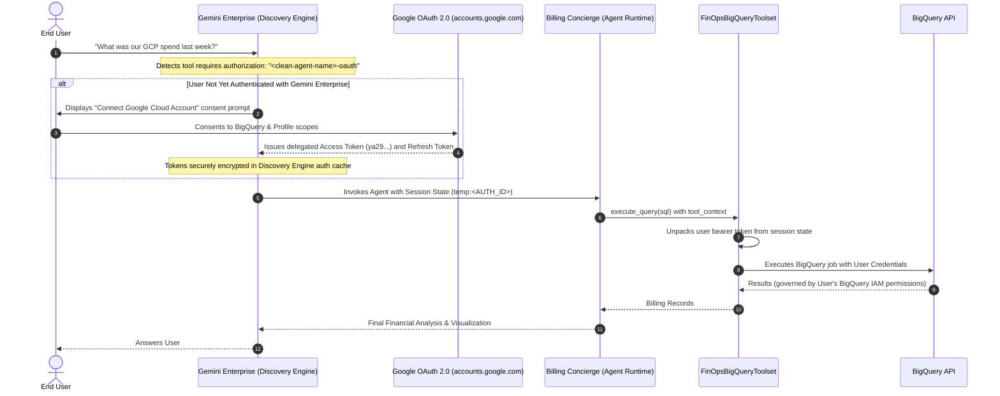
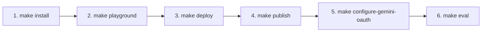

# 💰 Billing Concierge Agent
An intelligent automation agent that simplifies Google Cloud cost management. Starting with answering billing questions, this agent also acts as a FinOps concierge—capable of auditing environments, detecting anomalies, and provisioning monitoring infrastructure using natural language. Built with Google ADK, Gemini, and deployed via `google-agents-cli` on Agent Runtime (Gemini Enterprise Agent Platform).

🛠️ **Integrated Cloud Ecosystem:**
The agent seamlessly orchestrates the following Google Cloud services:
- **BigQuery**: Analysis of Standard/Detailed Billing Exports with strict FinOps dry-run cost controls.
- **Cloud Scheduler**: Automation of recurring cost audits and anomaly scans.
- **Cloud Monitoring**: Dynamic provisioning of Alert Policies and Notification Channels.
- **Cloud Logging**: Recording of detected billing anomalies for alerting and audit trails.
- **Secret Manager**: Secure, isolated storage of deployed Agent Runtime resource IDs.

---

## 📋 Prerequisites
Before running the setup, ensure you have:

* **Python 3.11+** and **uv package manager** [(uv Installation guide)](https://docs.astral.sh/uv/getting-started/installation/)
* **gcloud CLI** installed and authenticated:
  ```bash
  gcloud auth login
  gcloud auth application-default login
  ```
* **Google Agents CLI & ADK** installed via:
  ```bash
  uvx google-agents-cli setup
  ```
  [(ADK Docs)](https://adk.dev/get-started/installation/)
* **Gemini Enterprise application** (Optional, for conversational enterprise search/chat integration) with Gemini Enterprise or Business licenses. [(Gemini Enterprise Quickstart Guide)](https://docs.cloud.google.com/gemini/enterprise/docs/quickstart-gemini-enterprise).
* **Google OAuth 2.0 Web Client Credentials** (Required for End-User OAuth identity delegation):
  * Follow the steps on [Setting up OAuth 2.0](https://developers.google.com/identity/protocols/oauth2/web-server) to create your OAuth client ID.
  * **OAuth Consent Screen**: In Google Cloud Console (**APIs & Services > OAuth consent screen** or **Google Auth Platform > Branding**), configure an **Internal** app (recommended for Google Workspace organizations) or **External** app, specifying your support email and developer contact.
  * **Scopes**: Ensure the following scopes are added on the consent screen:
    * `https://www.googleapis.com/auth/bigquery` (View and manage data in Google BigQuery)
    * `https://www.googleapis.com/auth/userinfo.email`
    * `https://www.googleapis.com/auth/userinfo.profile`
    * `openid`
  * **OAuth Client ID**: Under **APIs & Services > Credentials**, click **Create Credentials > OAuth client ID**:
    * **Application Type**: **Web application**
    * **Name**: `Gemini Enterprise Billing Concierge Web Client`
    * **Authorized JavaScript origins**:
      * `http://localhost:8000`, `http://127.0.0.1:8000`
      * `http://localhost:8080`, `http://127.0.0.1:8080`
    * **Authorized redirect URIs** (Critical):
      * `https://vertexaisearch.cloud.google.com/static/oauth/oauth.html` (*Mandatory for Gemini Enterprise Discovery Engine callback*)
      * `http://127.0.0.1:8000/dev-ui/` and `http://localhost:8000/dev-ui/` (*For local ADK Web playground testing*)
      * `http://127.0.0.1:8080/dev-ui/` and `http://localhost:8080/dev-ui/`
  * **Save Credentials**: Copy your **Client ID** and **Client Secret**. You can add them to your `.env` file (`OAUTH_CLIENT_ID` and `OAUTH_CLIENT_SECRET`) or provide them interactively when running `make configure-gemini-oauth`.

### 📊 Billing Export Setup
**Recommended:** Enabling a BigQuery billing export is a standard FinOps best practice. The GCP Billing Concierge relies on this billing export for live querying.
If you do not have an existing export, the setup script (`make install`) includes an option to automatically generate a sample dataset and populate mock billing records for testing.

- [Official Documentation: Set up Cloud Billing data export to BigQuery](https://cloud.google.com/billing/docs/how-to/export-data-bigquery)
- **Key Requirement:** You must have the `Billing Account Administrator` role on the Cloud Billing account to enable this export.
- **Latency Note:** Once enabled, it can take 24 to 48 hours for the first data points to appear in BigQuery.

---

## 📂 Project Structure

```text
.
├── GCP_billing_concierge /            # Root directory for Agent Logic
│   ├── agent.py                       # Main Orchestrator Agent (Billing Concierge)
│   ├── prompt.py                      # Orchestrator system instructions & dynamic persona
│   ├── fast_api_app.py                # FastAPI HTTP server & OAuth middleware
│   ├── .env.example                   # Environment variable template
│   ├── skills/                        # ADK Agent Skills (analysis, alerting, scheduling)
│   ├── tools/
│   │   ├── finops_bigquery_toolset.py # BigQuery FinOps Toolset (token extraction, guardrails)
│   │   └── tools.py                   # Anomaly and audit logging tools
│   └── sub_agents/
│       └── finops_infra_agent/        # Specialized agent for Platform Ops
│           ├── agent.py               # Sub-agent: Handles infrastructure tasks
│           ├── prompt.py              # Sub-agent: Instructions for CRON and Monitoring
│           ├── toolset.py             # Infrastructure toolset class
│           └── tools/tools.py         # Custom tools (Scheduler, Alerts, Notifications)
├── deployment_scripts/                
│   ├── setup_billing_data.py          # Configures BQ dataset (Real or Mock)
│   ├── select_identity.py             # Interactive Security & Identity strategy picker
│   ├── create_sa.py                   # Provisions Agent Service Account & IAM roles
│   ├── grant_agent_identity_iam.py    # Binds post-deployment IAM roles to keyless identity
│   └── configure_gemini_enterprise_oauth.sh # Links Discovery Engine OAuth to published agent
├── mock_data/  
│   ├── billing_export_test_table.json # Sample billing dataset
│   └── billing_schema.json            # Sample billing dataset schema
├── new_agent_evals/                   # Modern ADK evaluation benchmark suite
│   ├── billing_eval_dataset_fully_modern.evalset.json
│   └── eval_config.json
├── agents-cli-manifest.yaml           # Manifest for google-agents-cli lifecycle
├── pyproject.toml                     # Project dependencies & configuration
├── Makefile                           # Unified automation (install, playground, deploy, publish, oauth, eval)
└── README.md
```

### Agent Architecture


---

## 🔑 Permissions & Security Strategy

### For the Admin (You)
* `roles/resourcemanager.projectIamAdmin`: To manage IAM bindings.
* `roles/iam.serviceAccountAdmin`: To create the service account identity (if Option 2 or 4 is selected).
* `roles/bigquery.admin`: To configure datasets and verify schemas.
* `roles/aiplatform.admin`: To deploy Reasoning Engines to Agent Runtime.
* `roles/secretmanager.admin`: To create and manage the Agent ID secret.
* `roles/discoveryengine.admin`: To configure OAuth authorizations and link agents in Gemini Enterprise.
* `roles/bigquery.dataViewer`: (Only needed if you query BigQuery yourself or seed sample test data).

### For the Agent Execution Identity

The agent supports four security and authorization strategies, selectable during `make install` (or anytime via `make select_identity`):

| Strategy | Identity Model | BigQuery Execution Identity | Agent Container BQ Data Access | Recommendation Level |
| :--- | :--- | :--- | :--- | :--- |
| **Option 1** | **Agent Identity** (Keyless) | **End-User OAuth 2.0** | ❌ **Denied** (Zero-Trust; no table access) | 🌟 **Recommended** |
| **Option 2** | **Service Account** | **End-User OAuth 2.0** | ❌ **Denied** (Zero-Trust; no table access) | 🛡️ Supported |
| **Option 3** | **Agent Identity** (Keyless) | **Agent Identity** | ✅ Granted (`roles/bigquery.dataViewer`) | ⚠️ Ambient Access |
| **Option 4** | **Service Account** | **Service Account** | ✅ Granted (`roles/bigquery.dataViewer`) | ⚠️ Least Recommended |

#### Details of Option 1: Agent Identity with OAuth (Recommended - Keyless Zero-Trust)
Vertex AI automatically mints a unique, keyless identity bound 1:1 to the Reasoning Engine lifecycle (`principal://agents.global.org-...`):
* **Base Roles (Granted automatically by `agents-cli deploy`)**:
  * `roles/aiplatform.user`, `roles/serviceusage.serviceUsageConsumer`, `roles/logging.logWriter`, `roles/monitoring.metricWriter`, `roles/browser`, `roles/cloudapiregistry.viewer`.
* **Application Roles (Configured post-deployment via `make grant_agent_identity_iam`)**:
  * BigQuery: `roles/bigquery.jobUser` on the compute project (to submit query jobs). **The container does NOT receive table read permissions.**
  * Platform Ops: `roles/cloudscheduler.admin`, `roles/monitoring.alertPolicyEditor`, `roles/monitoring.notificationChannelEditor`.
  * Logging & Secrets: `roles/logging.configWriter`, `roles/secretmanager.secretAccessor`.
  * Data & Telemetry: `roles/geminidataanalytics.dataAgentStatelessUser`, `roles/telemetry.writer`.

#### Details of Option 2: Service Account with OAuth
Uses a dedicated Google Cloud Service Account (`<agent-name>-sa`, defaulting to `gcp-billing-concierge-sa`):
* Receives the same application roles as Option 1 on the compute project, plus `roles/iam.serviceAccountUser` on itself.
* **The service account does NOT receive table read permissions.**

---

## 🔐 End-User OAuth 2.0 Security Architecture

To enforce strict FinOps governance and zero-trust access control, the GCP Billing Concierge implements **Dual-Mode End-User OAuth 2.0 Authentication**. Rather than querying billing data with a broad, shared service account, BigQuery queries are executed directly with the **personal Google Cloud IAM credentials of the chatting user**.

### 🛡️ Why End-User OAuth?
1. **Least Privilege Enforcement**: If a user lacks `roles/bigquery.jobUser` on the billing project or `roles/bigquery.dataViewer` on the billing export dataset/table, BigQuery returns HTTP 403 Forbidden. The agent's ambient credentials do not grant unauthorized data access.
2. **True Audit Compliance**: All queries appear in Google Cloud Audit Logs with the user's authentic corporate identity (`user@example.com`), satisfying enterprise compliance and accountability standards.
3. **Fail-Closed Protection**: With `REQUIRE_USER_OAUTH=true`, the agent immediately blocks execution if no authenticated user token is present, preventing silent fallback to service account privileges.

### 👤 End-User IAM Permissions Matrix
To successfully query billing data through the agent, the **chatting end user** must have the following IAM roles in Google Cloud:

| Role | Target Resource | Purpose |
| :--- | :--- | :--- |
| `roles/bigquery.jobUser` | Project (`GOOGLE_CLOUD_PROJECT` or `BILLING_EXPORT_PROJECT_ID`) | Allows the user to run BigQuery jobs (queries, dry-runs) in the project. |
| `roles/bigquery.dataViewer` | Dataset/Table (`BILLING_EXPORT_DATASET` / `BILLING_EXPORT_TABLE`) | Grants read access to the Cloud Billing export records. |

> [!IMPORTANT]
> **Zero Trust in Action:** If an employee without these roles tries to chat with the agent in Gemini Enterprise, BigQuery denies the query (`HTTP 403 Access Denied: User does not have bigquery.jobs.create permission` or `Permission Denied on table`). The AI agent cannot be used as an unintended privilege-escalation backdoor.

### 🔄 Dual-Mode Execution Architecture



### ⚙️ How Discovery Engine Authorization Works Under the Hood

The end-user authentication flow bridges Gemini Enterprise and Vertex AI Reasoning Engine:

1. **Discovery Engine Authorization Resource**:
   - Registered under `projects/{PROJECT_NUMBER}/locations/{LOCATION}/authorizations/{AUTH_ID}` (dynamically scoped to `<clean-agent-name>-oauth`, defaulting to `billing-ge-oauth` for `GCP_billing_concierge`).
   - Stores the server-side OAuth 2.0 Web Client credentials (`clientId`, `clientSecret`, redirect URI, and scopes).
   - Requires numeric **Project Number** (e.g., `813632901865`), which `configure-gemini-oauth` automatically fetches.

2. **Agent Specification Binding (`toolAuthorizations`)**:
   - Once the agent is published to Gemini Enterprise, its Discovery Engine resource is at:  
     `projects/{PROJECT_ID}/locations/{LOCATION}/collections/default_collection/engines/{APP_ID}/assistants/default_assistant/agents/{AGENT_ID}`
   - `make configure-gemini-oauth` sends a PATCH request updating `authorizationConfig.toolAuthorizations` to link the authorization resource.
   - This instructs Gemini Enterprise to enforce user consent before invoking the agent's BigQuery tools.

3. **Consent & Token Delegation**:
   - When the user asks a question, Gemini Enterprise prompts the user to **"Connect Google Cloud Account"**.
   - After user consent, Google OAuth redirects back to `https://vertexaisearch.cloud.google.com/static/oauth/oauth.html`.
   - Gemini Enterprise exchanges the authorization code for access and refresh tokens, caching them securely.
   - On each agent turn, Gemini Enterprise injects the delegated bearer token (`ya29...`) into the ADK session state under `temp:<AUTH_ID>`.

4. **Agent Runtime Execution**:
   - `FinOpsBigQueryToolset` inspects `tool_context.session.state` across recognized keys (`temp:<AUTH_ID>`, `temp:billing-ge-oauth`, `user_oauth_token`).
   - The token is unpacked into `google.oauth2.credentials.Credentials(token=access_token)`.
   - All BigQuery API operations (query dry-runs, executions, table metadata inspections) run directly under the end user's identity.

5. **Local Mode (ADK Web Playground)**:
   - When developing locally via `make playground`, ADK uses `GoogleCredentialsManager` with your `OAUTH_CLIENT_ID` and `OAUTH_CLIENT_SECRET`.
   - An interactive browser popup prompts for Google login and consent, storing the resulting token in local session state.

### ⚙️ OAuth Configuration Reference

| Environment Variable | Description | Default |
| :--- | :--- | :--- |
| `ENABLE_USER_OAUTH` | Enables resolution of end-user OAuth tokens for BigQuery queries | `true` |
| `REQUIRE_USER_OAUTH` | Strictly requires user tokens; returns `401 Unauthorized` if absent | `true` |
| `OAUTH_CLIENT_ID` | OAuth 2.0 Web Client ID from Google Cloud Console | *Required for OAuth* |
| `OAUTH_CLIENT_SECRET` | OAuth 2.0 Web Client Secret from Google Cloud Console | *Required for OAuth* |
| `AUTH_ID` | Authorization ID registered in Gemini Enterprise Discovery Engine | `<clean-agent-name>-oauth` (or `billing-ge-oauth`) |
| `EXTERNAL_ACCESS_TOKEN_KEY` | Session state key used to unpack user OAuth token | Defaults to `AUTH_ID` |

### 🌐 Regional vs Global Architecture Reference

| Environment Variable | Scope | Purpose | Recommended / Default |
| :--- | :--- | :--- | :--- |
| `GOOGLE_CLOUD_REGION` | **Regional** | Endpoint where the Agent Engine (Vertex AI Reasoning Engine runtime), Cloud Scheduler jobs, and Cloud Monitoring alert policies are hosted. | `us-central1` |
| `GOOGLE_CLOUD_LOCATION` | **Global** | Routing endpoint for Gemini foundation model inference via Vertex AI (`gemini-2.5-flash`). Separating this from the agent engine region ensures maximum model availability, lowest latency, and multi-region failover. | `global` |
| `BIGQUERY_LOCATION` | **Regional / Multi-regional** | BigQuery dataset location for billing export data. Automatically detected if omitted. | `US` |

---

## 🚀 Getting Started

You can set up the project using either of the following two paths:

### Path A: Using `google-agents-cli` (Fast Track)
```bash
# 1. Install Agents CLI and authenticate
uvx google-agents-cli setup
gcloud auth login
gcloud auth application-default login

# 2. Scaffold a new agent project from this repository template
export AGENT_NAME=billing-concierge-${RANDOM}
uvx google-agents-cli create ${AGENT_NAME} -d agent_runtime -a pemujo/GCP-Billing-Concierge
cd ${AGENT_NAME}
```

### Path B: Clone from GitHub (Development & Customization)
```bash
# 1. Authenticate with Google Cloud
gcloud auth login
gcloud auth application-default login

# 2. Clone repository and install dependencies
git clone https://github.com/pemujo/GCP-Billing-Concierge.git
cd GCP-Billing-Concierge
uv sync
```

---

## 🛠️ End-to-End Lifecycle Guide

Whether you created the project via Path A or Path B, follow this unified 6-step lifecycle:



### Step 1: Interactive Provisioning & Configuration (`make install`)
Run the automated installation wizard:
```bash
make install
```

> [!TIP]
> **Automatic `.env` Generation:** You do not need to manually create or edit `.env` files beforehand! `make install` interactively prompts for your settings and automatically writes `GCP_billing_concierge/.env` and `.env`:
> 1. **Execution Project (`GOOGLE_CLOUD_PROJECT`)**: Prompts for your Google Cloud Project ID (defaults to active `gcloud` project).
> 2. **API Activation**: Enables all required Cloud APIs (`aiplatform`, `bigquery`, `logging`, `monitoring`, `cloudscheduler`, `secretmanager`, etc.).
> 3. **Billing Data Source**:
>    - **Option 1 (Existing Billing Export)**: Prompts for your BigQuery dataset coordinates (`BILLING_EXPORT_PROJECT_ID`, `DATASET`, `TABLE`).
>    - **Option 2 (Sample Data)**: Automatically provisions a mock BigQuery dataset and loads sample GCP billing records for sandbox testing.
> 4. **Security & Identity Selection**: Prompts you to select from the 4 security strategies (Options 1–4). Option 1 (Agent Identity with OAuth) is recommended.
>
> *(Note: You can run `make select_identity` at any time to switch security models without re-running data setup).*

---

### Step 2: Test Locally in the Agent Playground (`make playground`)
Start the local interactive playground web UI:
```bash
make playground
```
* Launches the local Agent Dev-UI at `http://127.0.0.1:8000/dev-ui/?app=GCP_billing_concierge` (or your custom `?app=<sanitized_name>`).
* **Multi-Turn Chat**: Test cost inquiries, trend analyses, and infrastructure automation prompts.
* **Trace Viewer**: Inspect generated BigQuery SQL, dry-run scan cost estimates, and tool execution traces in real time.
* **Live Reloading**: Automatically hot-reloads when agent code or prompts change.

---

### Step 3: Deploy to Vertex AI Agent Runtime (`make deploy`)
Deploy your agent as a scalable, cloud-managed Reasoning Engine on Vertex AI:

```bash
# Deploy with a custom agent name (recommended):
make deploy AGENT_NAME="finops-billing-assistant"

# Or deploy with the default agent name (GCP_billing_concierge):
make deploy
```

**What `make deploy` does under the hood:**
1. **Name Sanitization**: Automatically converts `AGENT_NAME` (e.g. `finops-billing-assistant` $\rightarrow$ `finops_billing_assistant`) for Python ADK compliance while keeping the clean service name for Cloud Console and Gemini Enterprise.
2. **Identity Model Enforcement**:
   - **Agent Identity (Option 1)**: Deploys with keyless `--agent-identity`. Automatically runs `grant_agent_identity_iam.py` post-deployment to bind application IAM roles to the newly minted `principal://...` identifier.
   - **Service Account (Option 2)**: Deploys with `--service-account="<agent-name>-sa@<project>.iam.gserviceaccount.com"`.
3. **Environment Variable Injection**: Configures the cloud container with `ENABLE_USER_OAUTH=true`, `REQUIRE_USER_OAUTH=true`, `AUTH_ID=<clean-agent-name>-oauth`, and your BigQuery dataset coordinates.
4. **Isolated Secret Manager Storage**: Extracts the deployed Agent Resource ID and saves it in Secret Manager under `<clean-agent-name>-agent-id` (defaulting to `billing-concierge-agent-id` for `GCP_billing_concierge`), preventing secret collisions across multiple agents.
5. **Scoped Schedulers & Anomaly Alerting**: Automatically prefixes Cloud Scheduler jobs (`<agent-name>-<job>`) and scopes Cloud Monitoring alert policies (`<agent-name>-anomaly-detector`).
6. **BigQuery Job Attribution**: Attaches the agent's application name and label (`agent: <name>`) to BigQuery jobs for cost attribution.

---

### Step 4: Publish to Gemini Enterprise (`make publish`)
Register your deployed Reasoning Engine into your Gemini Enterprise (Discovery Engine) application so team members can discover and chat with it in the enterprise Agent Gallery:

```bash
make publish
# Or using the direct CLI command:
uvx google-agents-cli publish gemini-enterprise --interactive
```

**Interactive Publication Walkthrough:**
1. **Select Agent Runtime**: The CLI queries your Google Cloud project and displays active Reasoning Engines. Select your newly deployed agent (e.g., `finops-billing-assistant` or `GCP_billing_concierge`).
2. **Select Gemini Enterprise App**: The CLI lists your Discovery Engine engines (e.g., `us-region-pedro`). Select your target app.
3. **Agent & Tool Description**: `make publish` automatically provides the descriptive summary (*"FinOps billing concierge for Google Cloud cost analysis, anomaly detection, and automated spend monitoring."*), ensuring it displays appropriately in the enterprise gallery without defaulting to generic labels.
4. **Confirm Registration**: The CLI registers the agent with the Discovery Engine assistant.

> [!NOTE]
> At this stage, your agent is registered in Gemini Enterprise, but its tools are **not yet linked** to an OAuth authorization resource. Because `REQUIRE_USER_OAUTH=true` is enforced for zero-trust security, queries will fail closed until Step 5 is completed.

---

### Step 5: Link End-User OAuth (`make configure-gemini-oauth`)
Link the Discovery Engine OAuth 2.0 Authorization resource to your registered agent so BigQuery queries execute under each chatting user's personal identity:

```bash
# Configure OAuth for your custom agent:
make configure-gemini-oauth AGENT_NAME="finops-billing-assistant"

# Or for the default agent:
make configure-gemini-oauth
```

**What `make configure-gemini-oauth` automates:**
1. **Project Number Resolution**: Queries `gcloud projects describe` to resolve your numeric project number (e.g., `813632901865`), strictly required by Discovery Engine REST APIs.
2. **Agent-Aware Authorization Resource (`AUTH_ID`)**: Automatically scopes the default Authorization ID to `<clean-agent-name>-oauth` (defaulting to `billing-ge-oauth` for `GCP_billing_concierge`). Queries existing authorizations, highlights matches, and syncs the selection to `.env`.
3. **Authorization Verification & Creation**: Verifies or creates the server-side OAuth 2.0 Web Client resource in Discovery Engine using your `OAUTH_CLIENT_ID`, `OAUTH_CLIENT_SECRET`, and authorized redirect URI.
4. **Agent Discovery & Matching**: Queries registered agents within your Gemini Enterprise app, automatically detecting and pre-selecting the agent matching `AGENT_NAME`.
5. **Tool Authorization Binding**: Sends a PATCH request to Discovery Engine updating `authorizationConfig.toolAuthorizations`, binding the OAuth resource to the agent.

**The End-User Experience in Gemini Enterprise:**
* **User Query**: An end user asks: *"What was our Google Cloud spend last month?"*
* **Consent Card**: Gemini Enterprise intercepts the BigQuery tool call and renders an interactive **"Connect Google Cloud Account"** card.
* **OAuth Consent**: The user clicks **Connect**, reviews the consent screen on `accounts.google.com`, and grants permission for BigQuery.
* **Token Delegation**: Gemini Enterprise caches the token and injects the user's delegated bearer token (`ya29...`) into the ADK session state under `temp:<AUTH_ID>`.
* **Zero-Trust Enforcement**: The agent queries BigQuery directly under that user's identity. If the user does not have `roles/bigquery.jobUser` and dataset read access, BigQuery immediately denies the query with HTTP 403 Forbidden.

---

### Step 6: Benchmark Agent Accuracy (`make eval`)
Benchmark agent accuracy, tool call trajectory, and SQL correctness against the 50-case golden evaluation dataset:

```bash
# Run evaluations (automatically targets active sanitized app name):
make eval

# Or explicitly specify an agent name:
make eval AGENT_NAME="finops-billing-assistant"
```
Evaluation results, tool trajectory scores, and response match metrics are output to `new_agent_evals/results/`.

---

## 🏢 Multi-Agent Isolation Architecture

You can deploy and run multiple instances of the agent within the **same Google Cloud project** without resource collisions. Passing `AGENT_NAME="<name>"` guarantees complete isolation:

```text
Project: my-company-finops-project
├── Agent 1: AGENT_NAME="finops-billing-assistant"
│   ├── Reasoning Engine: finops-billing-assistant
│   ├── Secret Manager:   finops-billing-assistant-agent-id
│   ├── Cloud Scheduler:  finops-billing-assistant-monthly-audit, ...
│   ├── Cloud Logging:    finops-billing-assistant-anomaly-detector
│   ├── Alert Policy:     finops-billing-assistant-anomaly-detector
│   ├── Service Account:  finops-billing-assistant-sa (if SA mode)
│   ├── GE Authorization: finops-billing-assistant-oauth
│   └── BigQuery Labels:  agent: finops_billing_assistant
│
└── Agent 2: AGENT_NAME="finops-infra-auditor"
    ├── Reasoning Engine: finops-infra-auditor
    ├── Secret Manager:   finops-infra-auditor-agent-id
    ├── Cloud Scheduler:  finops-infra-auditor-monthly-audit, ...
    ├── Cloud Logging:    finops-infra-auditor-anomaly-detector
    ├── Alert Policy:     finops-infra-auditor-anomaly-detector
    ├── Service Account:  finops-infra-auditor-sa (if SA mode)
    ├── GE Authorization: finops-infra-auditor-oauth
    └── BigQuery Labels:  agent: finops_infra_auditor
```

---

## 🔍 Useful Commands & Troubleshooting

### Switch Security Strategy
You can switch identity and BigQuery authorization models at any time:
```bash
make select_identity
```

### Inspect Agent Authorizations in Discovery Engine
Verify tool authorizations linked to your agent:
```bash
curl -s -H "Authorization: Bearer $(gcloud auth print-access-token)" \
  -H "X-Goog-User-Project: ${GOOGLE_CLOUD_PROJECT}" \
  "https://${LOCATION}-discoveryengine.googleapis.com/v1alpha/projects/${GOOGLE_CLOUD_PROJECT}/locations/${LOCATION}/collections/default_collection/engines/${APP_ID}/assistants/default_assistant/agents/${AGENT_ID}" \
  | grep -A 5 "authorizationConfig"
```

### Reset Agent Authorizations
Unlink authorizations from an agent:
```bash
curl -s -X PATCH \
  -H "Authorization: Bearer $(gcloud auth print-access-token)" \
  -H "Content-Type: application/json" \
  -H "X-Goog-User-Project: ${GOOGLE_CLOUD_PROJECT}" \
  "https://${LOCATION}-discoveryengine.googleapis.com/v1alpha/projects/${GOOGLE_CLOUD_PROJECT}/locations/${LOCATION}/collections/default_collection/engines/${APP_ID}/assistants/default_assistant/agents/${AGENT_ID}?updateMask=authorizationConfig" \
  -d '{"authorizationConfig": {"toolAuthorizations": []}}'
```

---

## 📝 Disclaimer
This agent sample is provided for illustrative purposes only and is not intended for production use. It serves as a foundational starting point for teams to develop their own agents.

Users are responsible for the development, testing, and security hardening of any agents derived from this sample.
